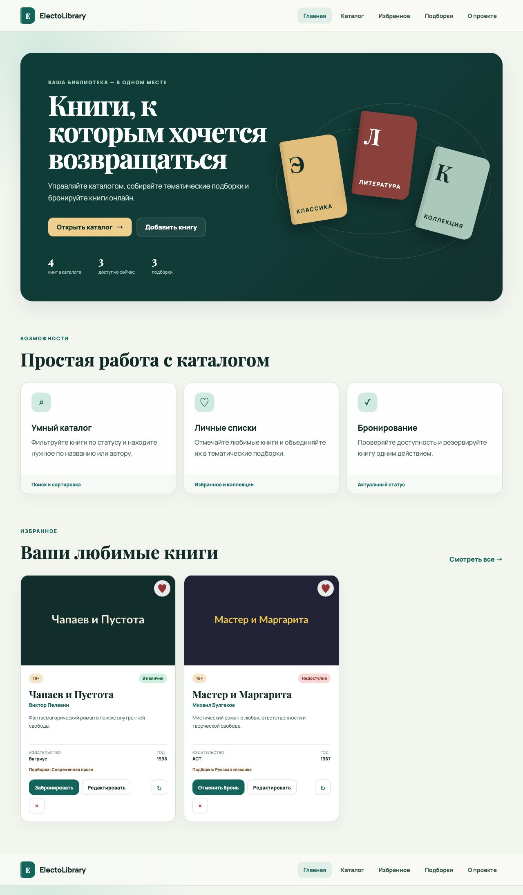
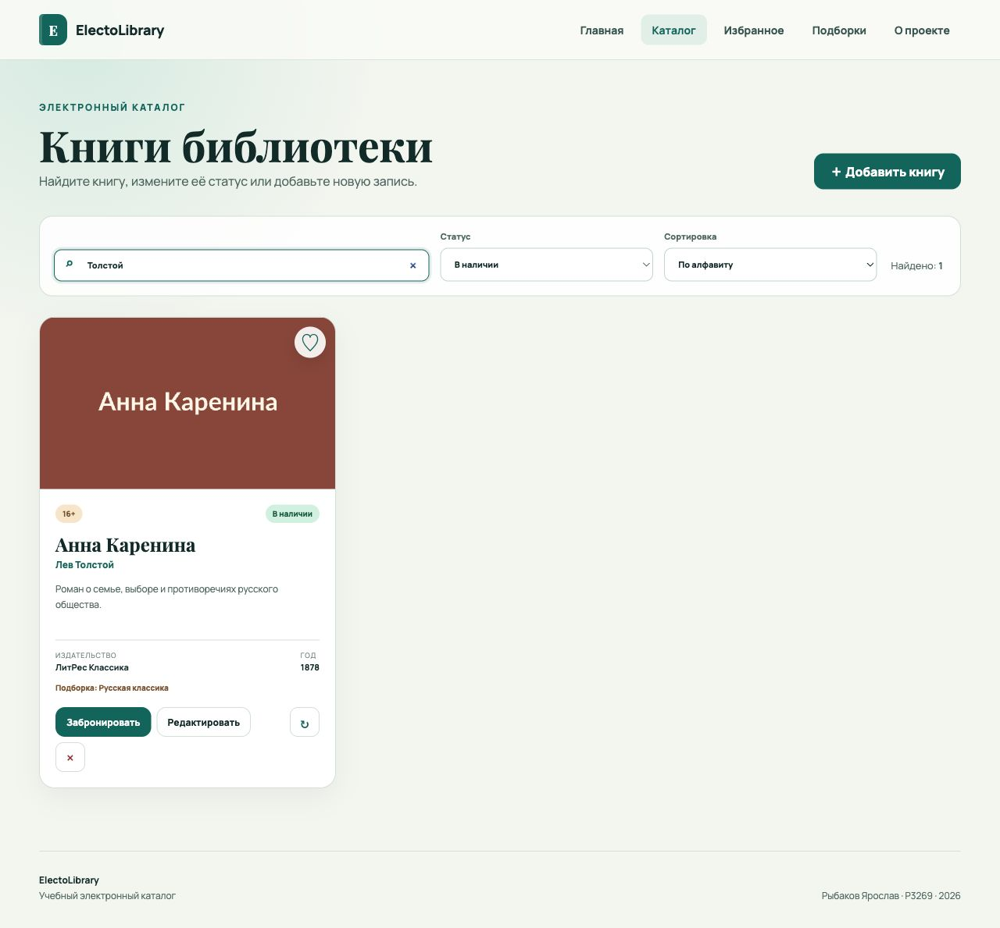
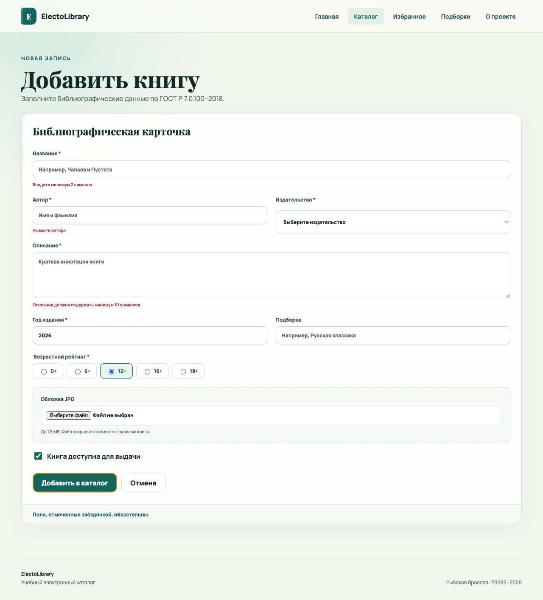
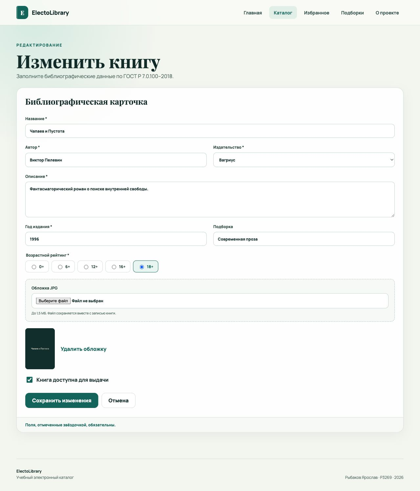
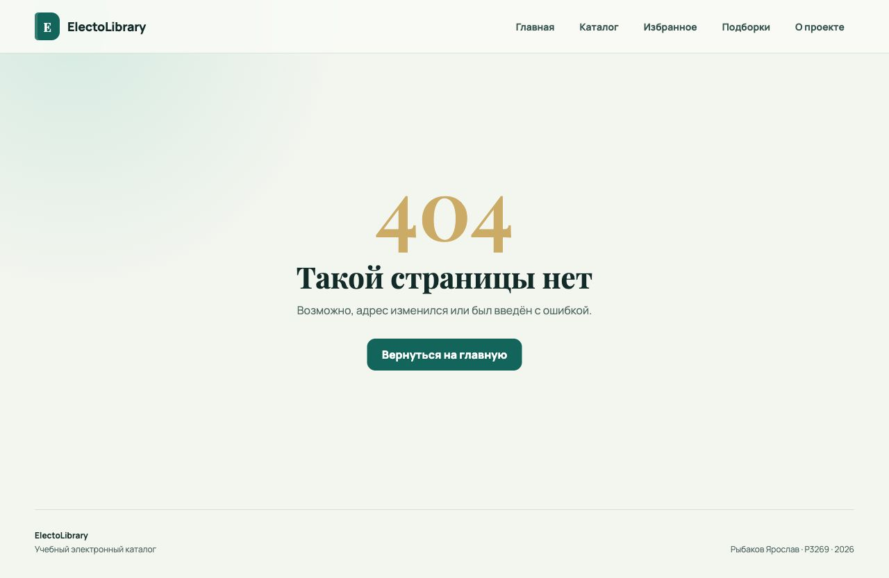

# ElectoLibrary

Итоговый проект по дисциплине «Разработка клиентской части веб-приложений»: SPA электронной библиотеки на Vue 3 с REST API на FastAPI, хранением данных в SQLite и контейнерным запуском.

**Автор:** Рыбаков Ярослав  
**Группа:** P3269  
**Дата:** 19 июня 2026 года  
**Репозиторий:** <https://github.com/pistaha/electolibrary-exam>

## Цель работы

Закрепить работу с реактивностью Vue 3, формами, компонентами, слотами, маршрутизацией, REST API и Docker на примере законченного клиент-серверного приложения.

## Реализованный функционал

- просмотр каталога и условный вывод пустого списка;
- фильтрация по наличию и поиск по названию, автору и издательству;
- сортировка по дате добавления и алфавиту;
- создание, просмотр, редактирование и удаление книг;
- загрузка JPG-обложки и проверка размера файла;
- изменение статуса доступности;
- добавление книг в избранное;
- бронирование и отмена бронирования;
- тематические подборки;
- адаптивная навигация и отдельная страница 404;
- постоянное хранение данных в SQLite.

## Vue 3: соответствие требованиям

| Требование | Реализация |
| --- | --- |
| `v-model` и модификаторы | Форма использует `v-model.trim` и `v-model.number` |
| События | `BookItem` отправляет `favorite`, `reserve`, `availability`, `delete` родителю |
| `computed` | Фильтрация/сортировка, статистика, избранное и группировка подборок |
| `watch` | Заголовок вкладки меняется при поиске; форма обновляется при смене исходной записи |
| Условный рендеринг | Загрузка, ошибки, пустые списки, обложка и статусы |
| `v-for` | Каталог, фильтры формы, подборки и карточки возможностей |
| props | `BookItem`, `BookList`, `BookForm`, `LayoutCard` |
| refs и жизненный цикл | Автофокус поиска через template ref и загрузка в `onMounted` |
| Обычный слот | Основное содержимое `LayoutCard` |
| Именованные слоты | `header`, `meta`, `footer` в `LayoutCard` |
| Scoped slot | `meta` передаёт наружу `label` и `accent` |
| Вложенные маршруты | Дочерние маршруты внутри `/books` |
| Именованные маршруты | Все маршруты имеют `name` |
| Программная навигация | Переход после сохранения и отмены формы |
| 404 | Маршрут `/:pathMatch(.*)*` |

## Компоненты

- `AppHeader.vue` и `AppFooter.vue` — общая оболочка;
- `BookList.vue` — список с `v-for` и пустым состоянием;
- `BookItem.vue` — карточка книги, props и дочерние события;
- `BookForm.vue` — единая форма создания/редактирования;
- `LayoutCard.vue` — обычный, именованные и scoped-слоты;
- `ToastMessage.vue` — уведомления с `Transition`.

## Маршруты

| Имя | URL | Назначение |
| --- | --- | --- |
| `home` | `/` | Dashboard |
| `books` | `/books` | Каталог |
| `book-new` | `/books/new` | Создание книги |
| `book-edit` | `/books/:id/edit` | Редактирование |
| `favorites` | `/favorites` | Избранное |
| `collections` | `/collections` | Подборки |
| `about` | `/about` | О проекте |
| `not-found` | любой неизвестный | Страница 404 |

## REST API

| Метод | Маршрут | Назначение |
| --- | --- | --- |
| GET | `/api/books` | Список книг |
| GET | `/api/books/{id}` | Одна книга |
| POST | `/api/books` | Создание |
| PUT | `/api/books/{id}` | Полное обновление |
| DELETE | `/api/books/{id}` | Удаление |
| PATCH | `/api/books/{id}/favorite` | Избранное |
| PATCH | `/api/books/{id}/reserve` | Бронирование |
| PATCH | `/api/books/{id}/availability` | Доступность |
| PATCH | `/api/books/{id}/collection` | Подборка |
| GET | `/api/collections` | Список подборок |

Swagger UI после запуска: <http://localhost:8000/docs>.

Пример хранимой записи:

```json
{
  "id": 1,
  "title": "Чапаев и Пустота",
  "author": "Виктор Пелевин",
  "publisher": "Вагриус",
  "publication_year": 1996,
  "age_rating": "18+",
  "available": true,
  "favorite": true,
  "reserved": false,
  "collection_name": "Современная проза"
}
```

## Структура

```text
exemK/
├── frontend/           # Vue 3 + Vite
│   ├── src/
│   │   ├── assets/
│   │   ├── components/
│   │   ├── composables/
│   │   ├── router/
│   │   ├── services/
│   │   └── views/
│   ├── Dockerfile
│   └── nginx.conf
├── backend/            # FastAPI + sqlite3
│   ├── main.py
│   ├── test_main.py
│   └── Dockerfile
├── data/tasks.db       # создаётся автоматически
├── docs/imgs/          # скриншоты отчёта
└── docker-compose.yml
```

## Локальный запуск

Backend:

```bash
cd backend
python -m venv .venv
source .venv/bin/activate
pip install -r requirements.txt
uvicorn main:app --reload --port 8000
```

Frontend в другом терминале:

```bash
cd frontend
npm install
npm run dev
```

Открыть <http://localhost:5173>.

## Запуск через Docker

```bash
docker compose build
docker compose up
```

Frontend: <http://localhost:3000>  
Backend: <http://localhost:8000>  
Swagger: <http://localhost:8000/docs>

Остановка:

```bash
docker compose down
```

## Проверка

```bash
cd backend
pip install -r requirements-dev.txt
pytest -q

cd ../frontend
npm install
npm run build
```

## Скриншоты интерфейса

### Главная страница



### Каталог: фильтрация и сортировка



### Форма создания и валидация



### Форма редактирования



### Страница 404



### Адаптивный интерфейс


## Выводы

В проекте реализован полный цикл разработки SPA: компонентная архитектура Vue 3, реактивные формы и списки, клиентская маршрутизация, обмен с REST API, запись каждой операции в SQLite, production-сборка Vite и запуск двух сервисов через Docker Compose.
